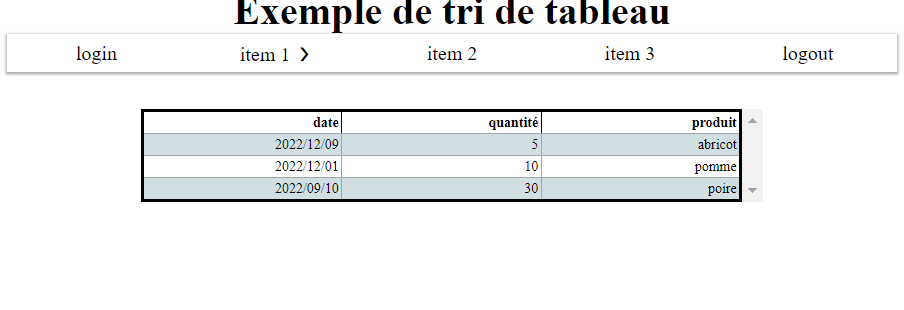

# tri de tableau en javaScript 

Un simple utilitaire de tri par entête de tableaux html en vanilla JS. Il est possible d'avoir plusieurs tableaux dans la page sans aucune manipulation de code supplémentaire.   

Les tableaux doivent être encapsulés dans une div sans ID (l'ajout d'ids est fait en JS). Les tableau doivent avoir thead et tbody (voir dans le fichier html). 

Le tri s'effectue sur des nombres, des chaînes de caractères et des dates si l'entête est 'date'. Voici avec un css rudimentaire : 

